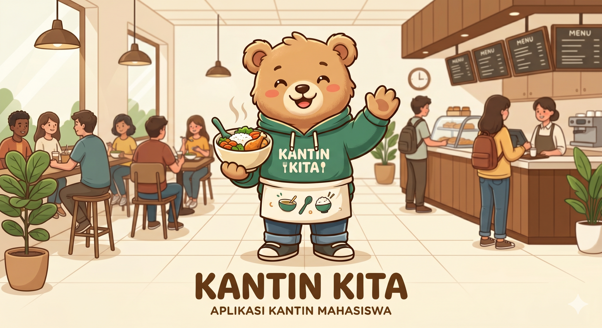

<p align="center">
  <picture>
    <source media="(prefers-color-scheme: dark)" srcset="https://raw.githubusercontent.com/laravel/art/master/logo-lockup/5%20SVG/2%20CMYK/1%20Full%20Color/laravel-logolockup-cmyk-red.svg">
    
  </picture>
</p>

<p align="center">
  <strong>Kantin Kita</strong> — Platform pemesanan makanan kampus tanpa antri.
  Pesan dari vendor favorit, bayar via QRIS, dan ambil tanpa menunggu.
</p>

<p align="center">
  <a href="https://kantin-kita.vercel.app">
    
  </a>
  <a href="https://github.com/ar-elfahmi/kantin-kita">
    
  </a>
  <a href="https://packagist.org/packages/laravel/framework">
    
  </a>
</p>

## Fitur

- **Pesan makanan** — Pilih vendor, lihat menu, atur ukuran & topping, checkout.
- **Pembayaran QRIS** — Midtrans Snap popup, bayar pindai langsung dari HP.
- **Dashboard Vendor** — Kelola menu, lihat pesanan masuk, cetak tag harga, scan barcode pesanan.
- **Panel Admin** — Kelola pengguna vendor, artikel, pantau transaksi.
- **Artikel** — Publikasi info & promo kampus.
- **Chatbot** — Tanya menu, jam operasional, rekomendasi (embedded di halaman vendor).

## Tech Stack

| Lapisan     | Teknologi                                         |
|-------------|---------------------------------------------------|
| Backend     | Laravel 13, PHP 8.3                               |
| Frontend    | Blade, Tailwind CSS 4, Vite 8                     |
| Database    | MySQL (runtime), SQLite (test)                    |
| Payment     | Midtrans Snap (QRIS / virtual account)            |
| Deployment  | Vercel (PHP runtime via `vercel-php`)             |

## Screenshot

<p align="center">
  
</p>

## Demo

**URL:** [https://kantin-kita.vercel.app](https://kantin-kita.vercel.app)

> Catatan: Database production terpisah. Untuk menjalankan lokal, ikuti panduan di bawah.

## Setup Lokal

```bash
# Clone
git clone https://github.com/ar-elfahmi/kantin-kita.git
cd kantin-kita

# Backend dependencies
composer install
cp .env.example .env
php artisan key:generate

# Frontend dependencies
npm install

# Database (pastikan MySQL aktif)
php artisan migrate --seed

# Development fullstack
composer run dev
```

## Testing

```bash
php artisan test
```

## Deployment

Project ini di-deploy ke **Vercel** menggunakan runtime `vercel-php@0.9.0` dengan build command `vite build`.

Konfigurasi deployment ada di `vercel.json`. Environment production diatur via Vercel Dashboard — file `.env` tidak pernah dikomit.

## Lisensi

[MIT](LICENSE)
