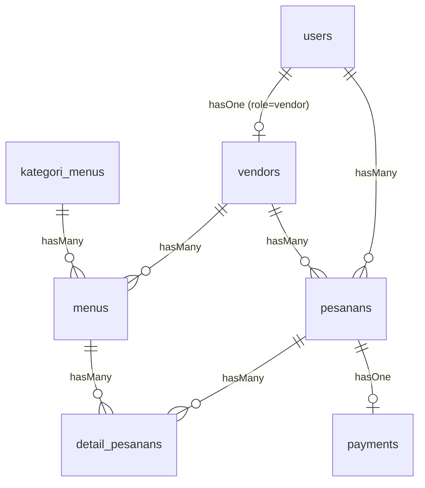
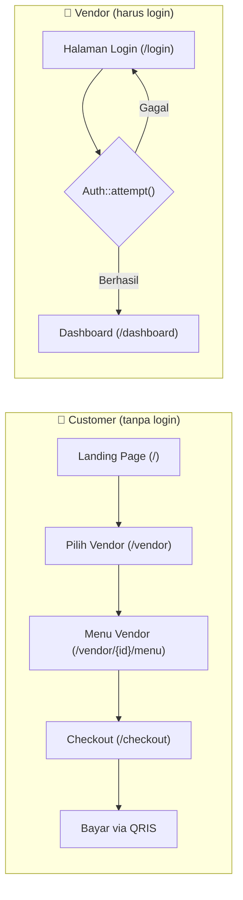
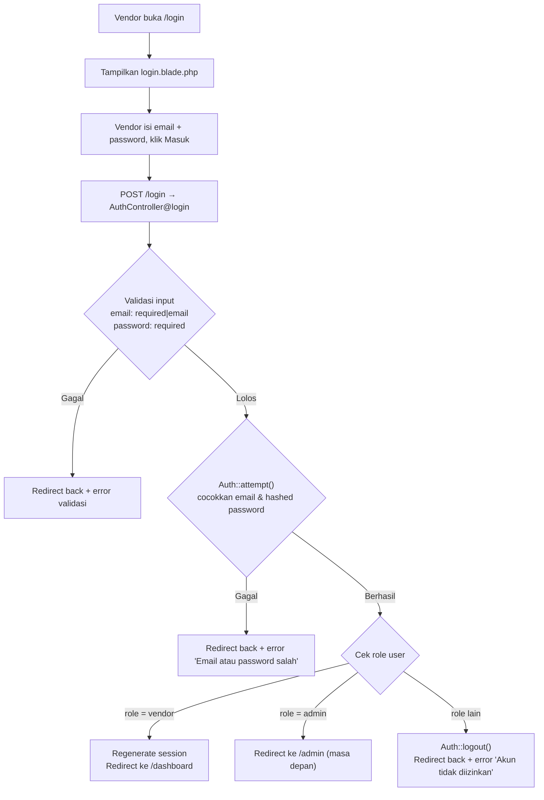
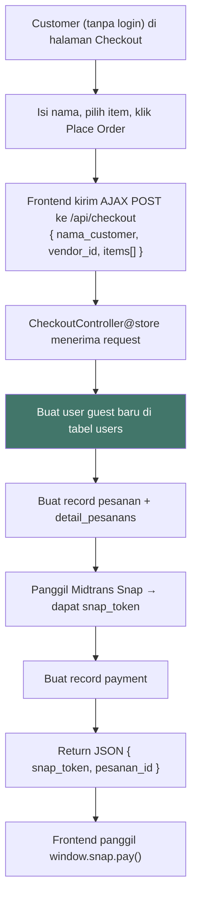
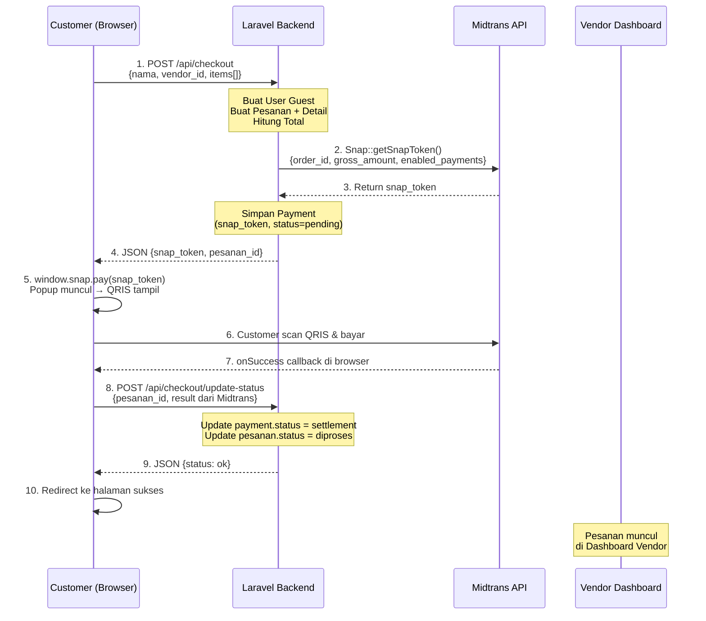

# Perencanaan Skema Database — Kantin Kita

> Dokumen ini menjadi panduan bagi programmer/model untuk membuat Migration, Model, dan Seeder di Laravel (tanpa starter kit) + MySQL.

---

## 1. Konteks & Aturan Bisnis

| # | Aturan |
|---|--------|
| 1 | **Multi-role**: Admin, Vendor, Customer — saat ini **hanya Vendor** yang perlu login ke Dashboard. |
| 2 | **Guest Checkout**: Customer bisa pesan tanpa login → sistem auto-generate user dengan `role = guest`. |
| 3 | **Pembayaran**: Midtrans **Snap Popup** (tampil di halaman, bukan redirect) → butuh tabel `payments` untuk menyimpan `snap_token`, `transaction_id`, dan `payment_type` dari callback Midtrans. |
| 4 | **1 pesanan = 1 vendor**: Satu transaksi checkout hanya berisi menu dari satu vendor (terlihat di halaman Checkout). |
| 5 | **Vendor hanya melihat pesanan yang sudah dibayar**: Dashboard Vendor **hanya menampilkan pesanan** yang payment status-nya `settlement`. Pesanan yang belum bayar / expired **tidak muncul** di sisi vendor. |
| 6 | **Customer tidak perlu login**: Customer langsung mengakses halaman Vendor dari Landing Page tanpa melalui login. Halaman login **hanya untuk Vendor**. |

---

## 2. Konfigurasi `.env`

Ubah koneksi database dari SQLite ke MySQL dan tambahkan Midtrans keys:

```env
DB_CONNECTION=mysql
DB_HOST=127.0.0.1
DB_PORT=3306
DB_DATABASE=kantin_kita
DB_USERNAME=root
DB_PASSWORD=

MIDTRANS_SERVER_KEY=SB-Mid-server-xxxxx
MIDTRANS_CLIENT_KEY=SB-Mid-client-xxxxx
MIDTRANS_IS_PRODUCTION=false
MIDTRANS_SNAP_URL=https://app.sandbox.midtrans.com/snap/snap.js
```

---

## 3. Skema Database (7 Tabel)

### 3.1. `users`

> Tabel autentikasi utama Laravel. Semua role (Admin, Vendor, Customer, Guest) masuk ke sini.

| Kolom | Tipe | Keterangan |
|-------|------|------------|
| `id` | `bigIncrements` | PK |
| `name` | `string` | Nama lengkap |
| `email` | `string, unique, nullable` | Nullable untuk guest |
| `password` | `string, nullable` | Nullable untuk guest |
| `role` | `enum('admin','vendor','customer','guest')` | Default: `'customer'` |
| `remember_token` | `string, nullable` | Untuk fitur "Ingat saya" |
| `timestamps` | — | `created_at`, `updated_at` |

**Catatan Implementasi:**
- Gunakan Laravel built-in Auth (`Hash::make`, `Auth::attempt`).
- Login form sudah mendukung field `identifier` (email/username) dan `password`.
- Untuk guest checkout, auto-create user dengan `name` = input nama customer, `role` = `'guest'`, `email` & `password` = null.

---

### 3.2. `vendors`

> Profil toko/warung. Relasi one-to-one ke `users` (user dengan `role = vendor`).

| Kolom | Tipe | Keterangan |
|-------|------|------------|
| `id` | `bigIncrements` | PK |
| `user_id` | `foreignId → users.id` | FK, onDelete cascade |
| `nama_vendor` | `string` | Nama warung |
| `deskripsi` | `text, nullable` | Deskripsi warung |
| `lokasi` | `string, nullable` | Contoh: "Gedung A, Lantai 1" |
| `kategori` | `string, nullable` | Contoh: "Indonesia", "Western" |
| `rating` | `decimal(2,1), default 0` | Rating rata-rata |
| `is_open` | `boolean, default true` | Status buka/tutup |
| `path_logo` | `string, nullable` | Path gambar logo vendor |
| `timestamps` | — | `created_at`, `updated_at` |

**Relasi:** `User hasOne Vendor`, `Vendor belongsTo User`

---

### 3.3. `kategori_menus`

> Kategori menu per vendor (Nasi & Lauk, Mie & Bakso, Camilan, Minuman, Dessert).

| Kolom | Tipe | Keterangan |
|-------|------|------------|
| `id` | `bigIncrements` | PK |
| `nama_kategori` | `string` | Nama kategori |
| `timestamps` | — | `created_at`, `updated_at` |

**Relasi:** `KategoriMenu hasMany Menu`

---

### 3.4. `menus`

> Daftar makanan/minuman per vendor.

| Kolom | Tipe | Keterangan |
|-------|------|------------|
| `id` | `bigIncrements` | PK |
| `vendor_id` | `foreignId → vendors.id` | FK, onDelete cascade |
| `kategori_menu_id` | `foreignId → kategori_menus.id, nullable` | FK, nullable |
| `nama_menu` | `string` | Nama menu |
| `deskripsi` | `text, nullable` | Deskripsi singkat |
| `harga` | `integer` | Harga dalam Rupiah (tanpa desimal) |
| `path_gambar` | `string, nullable` | Path gambar menu |
| `is_available` | `boolean, default true` | Ketersediaan menu |
| `timestamps` | — | `created_at`, `updated_at` |

**Relasi:** `Vendor hasMany Menu`, `Menu belongsTo Vendor`, `Menu belongsTo KategoriMenu`

---

### 3.5. `pesanans`

> Header pesanan (1 pesanan = 1 vendor, 1 customer).

| Kolom | Tipe | Keterangan |
|-------|------|------------|
| `id` | `bigIncrements` | PK |
| `user_id` | `foreignId → users.id` | FK customer/guest |
| `vendor_id` | `foreignId → vendors.id` | FK vendor |
| `nama_customer` | `string` | Nama pelanggan (untuk guest) |
| `total` | `integer` | Total harga keseluruhan |
| `catatan` | `text, nullable` | Catatan umum pesanan |
| `waktu_pengambilan` | `string, nullable` | Contoh: "15-20 min" |
| `status_pesanan` | `enum('pending','diproses','selesai','dibatalkan')` | Default: `'pending'` |
| `timestamps` | — | `created_at` = waktu pesan |

**Relasi:** `User hasMany Pesanan`, `Vendor hasMany Pesanan`, `Pesanan belongsTo User`, `Pesanan belongsTo Vendor`

---

### 3.6. `detail_pesanans`

> Item-item di dalam satu pesanan.

| Kolom | Tipe | Keterangan |
|-------|------|------------|
| `id` | `bigIncrements` | PK |
| `pesanan_id` | `foreignId → pesanans.id` | FK, onDelete cascade |
| `menu_id` | `foreignId → menus.id` | FK |
| `jumlah` | `integer` | Qty item |
| `harga` | `integer` | Harga satuan saat dipesan (snapshot) |
| `subtotal` | `integer` | `jumlah × harga` |
| `catatan` | `text, nullable` | Catatan per item (e.g. "less spicy") |
| `timestamps` | — | `created_at`, `updated_at` |

**Relasi:** `Pesanan hasMany DetailPesanan`, `DetailPesanan belongsTo Pesanan`, `DetailPesanan belongsTo Menu`

---

### 3.7. `payments`

> Tracking pembayaran Midtrans.

| Kolom | Tipe | Keterangan |
|-------|------|------------|
| `id` | `bigIncrements` | PK |
| `pesanan_id` | `foreignId → pesanans.id` | FK, onDelete cascade |
| `snap_token` | `string, nullable` | Token Snap Midtrans |
| `transaction_id` | `string, nullable` | ID transaksi dari Midtrans callback |
| `payment_type` | `string, default 'qris'` | Metode bayar (qris, gopay, dll) |
| `gross_amount` | `integer` | Jumlah yang dibayar |
| `status` | `enum('pending','settlement','expire','cancel','deny')` | Default: `'pending'` |
| `paid_at` | `timestamp, nullable` | Waktu pembayaran berhasil |
| `midtrans_response` | `json, nullable` | Simpan raw response untuk debugging |
| `timestamps` | — | `created_at`, `updated_at` |

**Relasi:** `Pesanan hasOne Payment`, `Payment belongsTo Pesanan`

---

## 4. Diagram Relasi



---

## 5. Data Seeder

Semua data berikut diekstrak dari UI statis yang sudah dibuat.

### 5.1. `UsersSeeder`

| name | email | password | role |
|------|-------|----------|------|
| Admin Kantin Kita | admin@kantinkita.id | `Hash::make('password')` | admin |
| Warung Nusantara | nusantara@kantinkita.id | `Hash::make('password')` | vendor |
| The Burger Hub | burgerhub@kantinkita.id | `Hash::make('password')` | vendor |
| Bubble Tea Corner | bubbletea@kantinkita.id | `Hash::make('password')` | vendor |
| Ramen Station | ramen@kantinkita.id | `Hash::make('password')` | vendor |
| Fresh & Healthy | freshhealty@kantinkita.id | `Hash::make('password')` | vendor |
| Campus Brew | campusbrew@kantinkita.id | `Hash::make('password')` | vendor |
| Warung Bu Sari | busari@kantinkita.id | `Hash::make('password')` | vendor |
| Warung Mbok Sri | mboksri@kantinkita.id | `Hash::make('password')` | vendor |

### 5.2. `VendorsSeeder`

> Setiap user vendor di atas otomatis dibuatkan 1 record vendor. Data di bawah berdasarkan halaman **Select Vendor** & **Menu Vendor**.

| nama_vendor | lokasi | kategori | rating | deskripsi (ringkas) |
|-------------|--------|----------|--------|---------------------|
| Warung Nusantara | Gedung A, Lantai 1 | Indonesia | 4.8 | Masakan Indonesia autentik dengan nasi goreng khas dan sate tradisional. Bahan segar setiap hari. |
| The Burger Hub | Gedung B, Lantai 2 | Western | 4.6 | Burger premium dengan daging sapi berkualitas, sayuran segar, dan saus homemade. |
| Bubble Tea Corner | Gedung A, Lantai 2 | Minuman | 4.9 | Bubble tea segar dengan berbagai rasa dan topping. Cocok untuk teman belajar! |
| Ramen Station | Gedung C, Lantai 1 | Asia | 4.7 | Ramen Jepang autentik dengan kuah kaya rasa dan topping segar. |
| Fresh & Healthy | Gedung B, Lantai 1 | Sehat | 4.5 | Salad bowl bergizi dan pilihan makanan sehat untuk mahasiswa. |
| Campus Brew | Gedung A, Lantai Dasar | Minuman | 5.0 | Kopi premium dan minuman spesial. Tempat ngopi favorit antar jam kuliah. |
| Warung Bu Sari | — | Indonesia | 4.8 | Masakan Indonesia autentik dengan bahan segar dan resep turun-temurun. |
| Warung Mbok Sri | Gedung A, Lantai Dasar | Indonesia | 4.8 | Warung masakan rumahan khas Jawa dengan cita rasa yang sudah teruji. |

### 5.3. `KategoriMenusSeeder`

| nama_kategori |
|---------------|
| Nasi & Lauk |
| Mie & Bakso |
| Camilan |
| Minuman |
| Dessert |

### 5.4. `MenusSeeder`

> Data dari halaman **Menu Vendor** (Warung Bu Sari) dan **Dashboard Vendor** (Warung Mbok Sri).

**Warung Bu Sari:**

| nama_menu | kategori | harga | deskripsi |
|-----------|----------|-------|-----------|
| Nasi Gudeg Ayam | Nasi & Lauk | 18000 | Gudeg nangka manis khas Jawa dengan ayam kampung yang empuk |
| Mie Ayam Special | Mie & Bakso | 15000 | Mie segar dengan ayam bumbu, sayuran dan kuah kaldu gurih |
| Gado-Gado | Nasi & Lauk | 12000 | Sayuran segar campur dengan saus kacang kental dan kerupuk |
| Sate Ayam | Camilan | 20000 | Sate ayam bakar dengan saus kacang pedas dan lontong |
| Es Teh Manis | Minuman | 5000 | Teh manis dingin yang menyegarkan, cocok teman makan |
| Bakso Special | Mie & Bakso | 16000 | Bakso sapi jumbo dengan mie, sayuran segar dan kuah kaldu |
| Pisang Goreng | Camilan | 8000 | Pisang goreng renyah, camilan manis yang sempurna |
| Es Jeruk Segar | Minuman | 8000 | Jus jeruk peras segar dengan es batu, kaya vitamin |

**Warung Mbok Sri (Dashboard):**

| nama_menu | kategori | harga | deskripsi |
|-----------|----------|-------|-----------|
| Nasi Goreng Spesial | Nasi & Lauk | 18000 | Nasi goreng dengan telur mata sapi, ayam, dan bumbu rahasia khas warung |
| Bakso Kuah Spesial | Mie & Bakso | 15000 | Bakso sapi dengan mie, sayuran segar dan kuah kaldu yang gurih |
| Soto Ayam Lamongan | Nasi & Lauk | 12000 | Soto ayam kuning dengan telur, soun, dan sayuran segar berkuah bening |
| Es Teh Manis | Minuman | 5000 | Teh manis dingin dengan es batu, kesegaran di hari yang panas |

### 5.5. `PesanansSeeder` (Opsional, untuk demo)

> Data dari halaman **Dashboard Vendor** → Pesanan Terbaru, dan **Checkout**.

Buat 3 pesanan sample dengan status berbeda:

| # | customer | vendor | status | total | items |
|---|----------|--------|--------|-------|-------|
| 1 | Guest "Ahmad" | Warung Mbok Sri | pending | 36000 | Nasi Goreng Spesial ×2 |
| 2 | Guest "Budi" | Warung Mbok Sri | diproses | 15000 | Bakso Kuah Spesial ×1 |
| 3 | Guest "Citra" | Warung Mbok Sri | selesai | 36000 | Soto Ayam Lamongan ×3 |

---

## 6. Urutan Eksekusi Migration

Jalankan dalam urutan ini agar foreign key tidak error:

1. `create_users_table`
2. `create_vendors_table`
3. `create_kategori_menus_table`
4. `create_menus_table`
5. `create_pesanans_table`
6. `create_detail_pesanans_table`
7. `create_payments_table`

---

## 7. Alur Autentikasi & Navigasi

### 7.0. Alur Navigasi Customer vs Vendor



> [!IMPORTANT]
> - **Customer TIDAK perlu login sama sekali**. Dari Landing Page, customer langsung bisa klik "Pesan Sekarang" atau navigasi ke `/vendor` untuk melihat daftar vendor.
> - **Halaman login (`/login`) hanya untuk Vendor** yang ingin mengakses Dashboard untuk melihat pesanan masuk.
> - Di Landing Page (`welcome.blade.php`), tombol "Masuk" di navbar mengarah ke `/login`, dan tombol CTA hero mengarah ke `/vendor`.

---

### 7a. Login Manual Vendor (tanpa Starter Kit)

#### Flowchart



#### Komponen yang Dibutuhkan

**1. Form Login (`login.blade.php` — sudah ada, perlu penyesuaian kecil)**

Form saat ini sudah benar:
- `method="POST"` ke `/login`
- `@csrf` token ✅
- Field `name="identifier"` → **harus diubah** menjadi `name="email"` agar sesuai kolom di tabel `users`
- Field `name="password"` ✅
- Checkbox `name="remember"` ✅

Tambahkan area tampil error:
```html
<!-- Letakkan di atas form fields -->
@if ($errors->any())
    <div class="alert-error">
        {{ $errors->first() }}
    </div>
@endif
```

**2. AuthController (`app/Http/Controllers/AuthController.php`)**

```php
<?php

namespace App\Http\Controllers;

use Illuminate\Http\Request;
use Illuminate\Support\Facades\Auth;

class AuthController extends Controller
{
    // GET /login → Tampilkan halaman login
    public function showLogin()
    {
        return view('login');
    }

    // POST /login → Proses login
    public function login(Request $request)
    {
        // 1. Validasi input
        $credentials = $request->validate([
            'email'    => 'required|email',
            'password' => 'required',
        ]);

        // 2. Coba autentikasi
        $remember = $request->boolean('remember');

        if (! Auth::attempt($credentials, $remember)) {
            // Gagal → kembali dengan pesan error
            return back()->withErrors([
                'email' => 'Email atau password salah.',
            ])->onlyInput('email');
        }

        // 3. Berhasil → cek role
        $user = Auth::user();

        if ($user->role !== 'vendor') {
            // Bukan vendor → logout dan tolak
            Auth::logout();
            return back()->withErrors([
                'email' => 'Akun Anda tidak memiliki akses ke dashboard.',
            ])->onlyInput('email');
        }

        // 4. Vendor valid → regenerate session & redirect
        $request->session()->regenerate();

        return redirect()->intended('/dashboard');
    }

    // POST /logout → Proses logout
    public function logout(Request $request)
    {
        Auth::logout();
        $request->session()->invalidate();
        $request->session()->regenerateToken();

        return redirect('/');
    }
}
```

**3. Proteksi Route dengan Middleware**

```php
// routes/web.php — route yang butuh login
Route::middleware('auth')->group(function () {
    Route::post('/logout', [AuthController::class, 'logout']);
    Route::get('/dashboard', [DashboardController::class, 'index']);
});
```

Jika vendor belum login dan akses `/dashboard`, Laravel otomatis redirect ke `/login` (karena nama route `login` sudah terdaftar).

**4. Tombol Logout di Dashboard (`dashboard-vendor.blade.php`)**

Ubah tombol logout di sidebar menjadi form POST:
```html
<form method="POST" action="/logout" style="display:inline">
    @csrf
    <button type="submit" class="sidebar-user">
        <!-- isi avatar & nama vendor seperti saat ini -->
        <svg class="sidebar-logout">...</svg>
    </button>
</form>
```

---

### 7b. Auto-Generate Guest User saat Checkout

#### Flowchart



#### Logika Pembuatan Guest User

**Kapan dibuat?** → Saat endpoint `/api/checkout` dipanggil (bukan saat buka halaman).

**Data yang disimpan:**

| Kolom | Nilai |
|-------|-------|
| `name` | Dari input `nama_customer` di checkout form |
| `email` | `null` (guest tidak punya email) |
| `password` | `null` (guest tidak bisa login) |
| `role` | `'guest'` |

**Pseudocode di CheckoutController@store:**

```php
public function store(Request $request)
{
    // 1. Validasi input
    $validated = $request->validate([
        'nama_customer'   => 'required|string|max:255',
        'vendor_id'       => 'required|exists:vendors,id',
        'items'           => 'required|array|min:1',
        'items.*.menu_id' => 'required|exists:menus,id',
        'items.*.jumlah'  => 'required|integer|min:1',
        'items.*.catatan' => 'nullable|string|max:500',
    ]);

    return DB::transaction(function () use ($validated) {

        // 2. Auto-generate user guest
        $guestUser = User::create([
            'name' => $validated['nama_customer'],
            'role' => 'guest',
            // email dan password otomatis null
        ]);

        // 3. Hitung total
        $total = 0;
        $itemsData = [];

        foreach ($validated['items'] as $item) {
            $menu = Menu::findOrFail($item['menu_id']);
            $subtotal = $menu->harga * $item['jumlah'];
            $total += $subtotal;

            $itemsData[] = [
                'menu_id'  => $menu->id,
                'jumlah'   => $item['jumlah'],
                'harga'    => $menu->harga,    // snapshot harga saat ini
                'subtotal' => $subtotal,
                'catatan'  => $item['catatan'] ?? null,
            ];
        }

        // 4. Buat pesanan
        $pesanan = Pesanan::create([
            'user_id'         => $guestUser->id,
            'vendor_id'       => $validated['vendor_id'],
            'nama_customer'   => $validated['nama_customer'],
            'total'           => $total,
            'status_pesanan'  => 'pending',
        ]);

        // 5. Buat detail pesanan
        foreach ($itemsData as $itemData) {
            $pesanan->detailPesanans()->create($itemData);
        }

        // 6. Buat Snap Token Midtrans
        \Midtrans\Config::$serverKey = config('midtrans.server_key');
        \Midtrans\Config::$isProduction = config('midtrans.is_production');

        $snapToken = \Midtrans\Snap::createTransaction([
            'transaction_details' => [
                'order_id'     => 'ORDER-' . $pesanan->id . '-' . time(),
                'gross_amount' => $total,
            ],
            'customer_details' => [
                'first_name' => $validated['nama_customer'],
            ],
        ])->token;

        // 7. Simpan payment
        Payment::create([
            'pesanan_id'   => $pesanan->id,
            'snap_token'   => $snapToken,
            'gross_amount' => $total,
            'status'       => 'pending',
        ]);

        // 8. Return token ke frontend
        return response()->json([
            'snap_token'  => $snapToken,
            'pesanan_id'  => $pesanan->id,
        ]);
    });
}
```

#### Kenapa Guest User Tetap Disimpan di `users`?

| Pertimbangan | Penjelasan |
|-------------|------------|
| **Relasi konsisten** | `pesanans.user_id` selalu punya foreign key yang valid, baik customer login maupun guest |
| **Pelacakan pesanan** | Vendor bisa lihat siapa yang memesan (nama) walaupun customer tidak punya akun |
| **Skalabilitas** | Di masa depan, guest bisa "upgrade" jadi customer terdaftar tanpa harus migrasi data |
| **Laporan** | Admin bisa hitung total unique customers (termasuk guest) |

#### Modifikasi Checkout UI

Checkout form **saat ini belum** memiliki input nama customer. Tambahkan field nama di area Order Summary:

```html
<!-- Tambahkan sebelum tombol Place Order -->
<div class="form-group">
    <label class="form-label">Nama Pemesan</label>
    <input class="promo-input" type="text" id="nama_customer"
           placeholder="Masukkan nama Anda" required />
</div>
```

#### Contoh AJAX Call dari Frontend

```javascript
document.querySelector('.place-order-btn').addEventListener('click', async () => {
    const namaCustomer = document.getElementById('nama_customer').value;

    if (!namaCustomer.trim()) {
        alert('Silakan isi nama pemesan');
        return;
    }

    // Kumpulkan data cart (dari DOM atau state JavaScript)
    const items = [];
    document.querySelectorAll('.cart-item-card').forEach(card => {
        items.push({
            menu_id: card.dataset.menuId,
            jumlah: parseInt(card.querySelector('.qty-value').textContent),
            catatan: card.querySelector('.instructions-input')?.value || null,
        });
    });

    // Kirim ke backend
    const response = await fetch('/api/checkout', {
        method: 'POST',
        headers: {
            'Content-Type': 'application/json',
            'Accept': 'application/json',
        },
        body: JSON.stringify({
            nama_customer: namaCustomer,
            vendor_id: VENDOR_ID, // dari data page
            items: items,
        }),
    });

    const data = await response.json();

    // Buka Midtrans Snap Popup
    window.snap.pay(data.snap_token, {
        onSuccess: (result) => {
            window.location.href = '/order/success/' + data.pesanan_id;
        },
        onPending: (result) => {
            alert('Menunggu pembayaran...');
        },
        onError: (result) => {
            alert('Pembayaran gagal. Silakan coba lagi.');
        },
        onClose: () => {
            console.log('Popup ditutup tanpa menyelesaikan pembayaran');
        },
    });
});
```

---

## Catatan Tambahan

> [!NOTE]
> - Untuk Midtrans, install package `midtrans/midtrans-php` via Composer.
> - Buat file `config/midtrans.php` untuk menyimpan konfigurasi dari `.env`.

> [!TIP]
> - Gunakan `$table->integer('harga')` bukan `decimal` — karena Rupiah tidak pakai sen.
> - Simpan `harga` di `detail_pesanans` sebagai snapshot agar jika vendor ubah harga menu, pesanan lama tetap akurat.

---

## 8. Integrasi Midtrans QRIS — Panduan Lengkap di Localhost

### 8.1. Persiapan Akun & API Key

#### Langkah-langkah:

1. **Buat akun** di [https://dashboard.sandbox.midtrans.com](https://dashboard.sandbox.midtrans.com)
2. Masuk ke **Settings → Access Keys**
3. Catat dua key:
   - `Server Key` (contoh: `SB-Mid-server-xxxxxx`) — dipakai di **backend**
   - `Client Key` (contoh: `SB-Mid-client-xxxxxx`) — dipakai di **frontend**
4. Masuk ke **Settings → Snap Preferences**
   - Aktifkan metode pembayaran **QRIS** (centang)
   - Nonaktifkan metode lain jika hanya ingin QRIS saja
5. **Notification URL** → kosongkan dulu (tidak diperlukan untuk pendekatan sederhana ini)

---

### 8.2. Install Package

```bash
composer require midtrans/midtrans-php
```

Package ini menyediakan class:
- `\Midtrans\Config` — set server key & environment
- `\Midtrans\Snap` — buat Snap Token
- `\Midtrans\Notification` — parse callback dari Midtrans

---

### 8.3. Buat Config File

**File baru: `config/midtrans.php`**

```php
<?php

return [
    'server_key'    => env('MIDTRANS_SERVER_KEY', ''),
    'client_key'    => env('MIDTRANS_CLIENT_KEY', ''),
    'is_production' => env('MIDTRANS_IS_PRODUCTION', false),
    'snap_url'      => env('MIDTRANS_IS_PRODUCTION', false)
        ? 'https://app.midtrans.com/snap/snap.js'
        : 'https://app.sandbox.midtrans.com/snap/snap.js',
];
```

**Tambahkan di `.env`:**

```env
MIDTRANS_SERVER_KEY=SB-Mid-server-xxxxxx
MIDTRANS_CLIENT_KEY=SB-Mid-client-xxxxxx
MIDTRANS_IS_PRODUCTION=false
```

---

### 8.4. Arsitektur Request — Flowchart (Pendekatan Sederhana)

Karena ini pertama kali mengintegrasikan payment gateway, kita gunakan pendekatan **frontend-driven update** — tanpa perlu Ngrok atau webhook server-side.



> [!TIP]
> **Kenapa pendekatan ini lebih mudah?**
> - ❌ Tidak perlu install/setup Ngrok
> - ❌ Tidak perlu konfigurasi Notification URL di Midtrans Dashboard
> - ❌ Tidak perlu `PaymentCallbackController` terpisah
> - ✅ Cukup tangani response di frontend (`onSuccess`) lalu kirim update ke backend
> - ⚠️ Untuk produksi nanti, tinggal tambahkan webhook sebagai pengaman tambahan

---

### 8.5. Kode Backend — Dari Controller ke Snap Token

#### `CheckoutController@store` — Mendapatkan Snap Token

Berikut alur lengkap di dalam method `store()`:

```php
// === STEP 1: Setup Midtrans Config ===
\Midtrans\Config::$serverKey    = config('midtrans.server_key');
\Midtrans\Config::$isProduction = config('midtrans.is_production');
\Midtrans\Config::$isSanitized  = true;   // auto-sanitize input
\Midtrans\Config::$is3ds        = false;   // tidak perlu untuk QRIS

// === STEP 2: Siapkan parameter transaksi ===
$orderId = 'KK-' . $pesanan->id . '-' . time();
// Format: KK-15-1713100800 (unik per transaksi)

$params = [
    // Detail transaksi (WAJIB)
    'transaction_details' => [
        'order_id'     => $orderId,
        'gross_amount' => $pesanan->total,
    ],

    // Data customer (opsional tapi disarankan)
    'customer_details' => [
        'first_name' => $pesanan->nama_customer,
    ],

    // BATASI hanya QRIS
    'enabled_payments' => [
        'gopay',        // GoPay QRIS
        'shopeepay',    // ShopeePay QRIS
        'other_qris',   // QRIS generik (Dana, OVO, dll)
    ],

    // Detail item (opsional tapi bagus untuk rincian di Midtrans Dashboard)
    'item_details' => $pesanan->detailPesanans->map(fn($d) => [
        'id'       => $d->menu_id,
        'price'    => $d->harga,
        'quantity' => $d->jumlah,
        'name'     => $d->menu->nama_menu,
    ])->toArray(),
];

// === STEP 3: Request ke Midtrans API ===
$snapToken = \Midtrans\Snap::getSnapToken($params);
// Midtrans akan POST ke https://app.sandbox.midtrans.com/snap/v1/transactions
// dan mengembalikan string snap_token

// === STEP 4: Simpan ke tabel payments ===
Payment::create([
    'pesanan_id'   => $pesanan->id,
    'snap_token'   => $snapToken,
    'gross_amount' => $pesanan->total,
    'status'       => 'pending',
]);

// === STEP 5: Return ke frontend ===
return response()->json([
    'snap_token' => $snapToken,
    'pesanan_id' => $pesanan->id,
]);
```

> [!NOTE]
> `enabled_payments` adalah kunci untuk **membatasi metode QRIS saja**. Tanpa parameter ini, Midtrans akan menampilkan semua metode pembayaran (Transfer Bank, Kartu Kredit, dll).

---

### 8.6. Update Status Pembayaran (Pendekatan Sederhana)

Alih-alih menggunakan Ngrok + webhook server-side, kita **cukup tangani response dari Snap popup di frontend**, lalu kirim update ke backend via AJAX.

#### Buat endpoint update status: `CheckoutController@updateStatus`

```php
// Tambahkan method ini di CheckoutController

public function updateStatus(Request $request)
{
    $validated = $request->validate([
        'pesanan_id'     => 'required|exists:pesanans,id',
        'transaction_id' => 'required|string',
        'payment_type'   => 'required|string',
        'status'         => 'required|in:success,pending,error',
    ]);

    $payment = Payment::where('pesanan_id', $validated['pesanan_id'])->firstOrFail();
    $pesanan = $payment->pesanan;

    switch ($validated['status']) {
        case 'success':
            $payment->update([
                'status'         => 'settlement',
                'transaction_id' => $validated['transaction_id'],
                'payment_type'   => $validated['payment_type'],
                'paid_at'        => now(),
            ]);
            $pesanan->update(['status_pesanan' => 'diproses']);
            break;

        case 'pending':
            // Status tetap pending, tidak perlu update
            break;

        case 'error':
            $payment->update(['status' => 'cancel']);
            $pesanan->update(['status_pesanan' => 'dibatalkan']);
            break;
    }

    return response()->json(['status' => 'ok']);
}
```

#### Route:

```php
// routes/api.php
Route::post('/checkout',               [CheckoutController::class, 'store']);
Route::post('/checkout/update-status',  [CheckoutController::class, 'updateStatus']);
```

> [!NOTE]
> Pendekatan ini **sangat cocok untuk sandbox/development** di localhost.
> Untuk produksi nanti, Anda bisa menambahkan webhook (Notification URL) sebagai pengaman — tapi untuk belajar pertama kali, ini sudah cukup.

---

### 8.7. Frontend — Snap Popup di Checkout

**1. Load Snap JS (di `checkout.blade.php`):**

```html
<!-- Letakkan sebelum </body> -->
<script src="{{ config('midtrans.snap_url') }}" 
        data-client-key="{{ config('midtrans.client_key') }}"></script>
```

**2. Handle tombol Place Order + Update Status:**

Perhatikan pada `onSuccess`: setelah Midtrans memberi tahu pembayaran berhasil, frontend **langsung kirim update ke backend** sebelum redirect.

```javascript
document.querySelector('.place-order-btn').addEventListener('click', async () => {
    const namaCustomer = document.getElementById('nama_customer').value;
    if (!namaCustomer.trim()) {
        alert('Silakan isi nama pemesan');
        return;
    }

    // Kumpulkan data cart
    const items = [];
    document.querySelectorAll('.cart-item-card').forEach(card => {
        items.push({
            menu_id: card.dataset.menuId,
            jumlah:  parseInt(card.querySelector('.qty-value').textContent),
            catatan: card.querySelector('.instructions-input')?.value || null,
        });
    });

    // STEP 1: Kirim data checkout ke backend → dapat snap_token
    const res = await fetch('/api/checkout', {
        method: 'POST',
        headers: { 'Content-Type': 'application/json', 'Accept': 'application/json' },
        body: JSON.stringify({
            nama_customer: namaCustomer,
            vendor_id: VENDOR_ID,
            items: items,
        }),
    });
    const data = await res.json();

    // STEP 2: Tampilkan popup Midtrans
    window.snap.pay(data.snap_token, {
        onSuccess: async (result) => {
            // STEP 3: Pembayaran berhasil → update status di backend
            await fetch('/api/checkout/update-status', {
                method: 'POST',
                headers: { 'Content-Type': 'application/json' },
                body: JSON.stringify({
                    pesanan_id:     data.pesanan_id,
                    transaction_id: result.transaction_id,
                    payment_type:   result.payment_type,
                    status:         'success',
                }),
            });
            // STEP 4: Redirect ke halaman sukses
            window.location.href = '/order/success/' + data.pesanan_id;
        },
        onPending: (result) => {
            alert('Menunggu pembayaran. Silakan selesaikan scan QRIS.');
        },
        onError: async (result) => {
            // Update status gagal
            await fetch('/api/checkout/update-status', {
                method: 'POST',
                headers: { 'Content-Type': 'application/json' },
                body: JSON.stringify({
                    pesanan_id: data.pesanan_id,
                    transaction_id: result.transaction_id || '',
                    payment_type: result.payment_type || 'qris',
                    status: 'error',
                }),
            });
            alert('Pembayaran gagal. Silakan coba lagi.');
        },
        onClose: () => {
            console.log('Popup ditutup tanpa menyelesaikan pembayaran');
        },
    });
});
```

---

### 8.8. Testing QRIS di Sandbox

Setelah semua siap, gunakan **Midtrans Sandbox Simulator** untuk test:

1. Buka halaman Checkout → isi nama → klik Place Order
2. Popup Midtrans muncul → pilih QRIS
3. Midtrans menampilkan QR Code (sandbox)
4. Buka [https://simulator.sandbox.midtrans.com/qris/index](https://simulator.sandbox.midtrans.com/qris/index)
5. Paste QR string / upload QR image
6. Klik **Pay** di simulator
7. Popup Midtrans otomatis mendeteksi pembayaran → trigger `onSuccess`
8. Frontend kirim update ke `/api/checkout/update-status`
9. Cek:
   - Tabel `payments` → status berubah jadi `settlement`
   - Tabel `pesanans` → status berubah jadi `diproses`
   - Dashboard Vendor → pesanan baru muncul ✅

#### Checklist Testing:

| # | Test Case | Expected |
|---|-----------|----------|
| 1 | Bayar sukses via simulator | `onSuccess` → update backend → pesanan muncul di dashboard |
| 2 | Tutup popup tanpa bayar | Pesanan tetap pending, tidak muncul di dashboard |
| 3 | Buka dashboard vendor | Hanya pesanan settlement yang tampil |

---

### 8.9. Aturan Tampil di Dashboard Vendor

Query pesanan di Dashboard Vendor harus **selalu filter payment settlement**:

```php
// Di DashboardController@index
$pesanans = Pesanan::where('vendor_id', $vendor->id)
    ->whereHas('payment', fn($q) => $q->where('status', 'settlement'))
    ->latest()
    ->get();
```

Dengan ini, vendor **tidak akan pernah terganggu** oleh pesanan yang belum atau gagal dibayar.

---

## 9. Arsitektur Models

Semua model disimpan di `app/Models/`. Gunakan konvensi Laravel.

### 9.1. `User`

> File: `app/Models/User.php` (sudah ada dari Laravel, tinggal modifikasi)

```php
// Fillable
protected $fillable = ['name', 'email', 'password', 'role'];

// Hidden
protected $hidden = ['password', 'remember_token'];

// Casts
protected $casts = ['password' => 'hashed'];

// Relasi
public function vendor()    → hasOne(Vendor::class)
public function pesanans()  → hasMany(Pesanan::class)

// Helper
public function isVendor()  → return $this->role === 'vendor'
public function isAdmin()   → return $this->role === 'admin'
public function isGuest()   → return $this->role === 'guest'
```

---

### 9.2. `Vendor`

> File: `app/Models/Vendor.php`

```php
// Fillable
protected $fillable = [
    'user_id', 'nama_vendor', 'deskripsi', 'lokasi',
    'kategori', 'rating', 'is_open', 'path_logo'
];

// Casts
protected $casts = ['is_open' => 'boolean', 'rating' => 'decimal:1'];

// Relasi
public function user()     → belongsTo(User::class)
public function menus()    → hasMany(Menu::class)
public function pesanans() → hasMany(Pesanan::class)
```

---

### 9.3. `KategoriMenu`

> File: `app/Models/KategoriMenu.php`

```php
// Table (override karena nama tidak konvensional)
protected $table = 'kategori_menus';

// Fillable
protected $fillable = ['nama_kategori'];

// Relasi
public function menus() → hasMany(Menu::class)
```

---

### 9.4. `Menu`

> File: `app/Models/Menu.php`

```php
// Fillable
protected $fillable = [
    'vendor_id', 'kategori_menu_id', 'nama_menu',
    'deskripsi', 'harga', 'path_gambar', 'is_available'
];

// Casts
protected $casts = ['is_available' => 'boolean'];

// Relasi
public function vendor()       → belongsTo(Vendor::class)
public function kategoriMenu() → belongsTo(KategoriMenu::class)
public function detailPesanans() → hasMany(DetailPesanan::class)
```

---

### 9.5. `Pesanan`

> File: `app/Models/Pesanan.php`

```php
// Fillable
protected $fillable = [
    'user_id', 'vendor_id', 'nama_customer',
    'total', 'catatan', 'waktu_pengambilan', 'status_pesanan'
];

// Relasi
public function user()           → belongsTo(User::class)
public function vendor()         → belongsTo(Vendor::class)
public function detailPesanans() → hasMany(DetailPesanan::class)
public function payment()        → hasOne(Payment::class)

// Scope: hanya pesanan yang sudah dibayar (untuk vendor)
public function scopeSudahDibayar($query)
    → $query->whereHas('payment', fn($q) => $q->where('status', 'settlement'))
```

---

### 9.6. `DetailPesanan`

> File: `app/Models/DetailPesanan.php`

```php
// Fillable
protected $fillable = [
    'pesanan_id', 'menu_id', 'jumlah',
    'harga', 'subtotal', 'catatan'
];

// Relasi
public function pesanan() → belongsTo(Pesanan::class)
public function menu()    → belongsTo(Menu::class)
```

---

### 9.7. `Payment`

> File: `app/Models/Payment.php`

```php
// Fillable
protected $fillable = [
    'pesanan_id', 'snap_token', 'transaction_id',
    'payment_type', 'gross_amount', 'status',
    'paid_at', 'midtrans_response'
];

// Casts
protected $casts = [
    'paid_at' => 'datetime',
    'midtrans_response' => 'array'
];

// Relasi
public function pesanan() → belongsTo(Pesanan::class)
```

---

## 10. Arsitektur Controllers

Semua controller disimpan di `app/Http/Controllers/`.

### 10.1. `HomeController`

> Halaman publik: Landing Page

| Method | HTTP | Route | Deskripsi |
|--------|------|-------|-----------|
| `index()` | GET | `/` | Tampilkan `welcome.blade.php` |

---

### 10.2. `AuthController`

> Login & Logout untuk Vendor (dan Admin di masa depan)

| Method | HTTP | Route | Deskripsi |
|--------|------|-------|-----------|
| `showLogin()` | GET | `/login` | Tampilkan form `login.blade.php` |
| `login()` | POST | `/login` | Validasi kredensial dengan `Auth::attempt()`, redirect ke `/dashboard` jika vendor |
| `logout()` | POST | `/logout` | `Auth::logout()`, redirect ke `/` |

**Detail `login()`:**
```
1. Validasi input: identifier (email), password
2. Auth::attempt(['email' => $identifier, 'password' => $password])
3. Cek role === 'vendor' → redirect('/dashboard')
4. Gagal → redirect back with error
```

---

### 10.3. `VendorController`

> Halaman publik: Pilih Vendor & Lihat Menu Vendor

| Method | HTTP | Route | Deskripsi |
|--------|------|-------|-----------|
| `index()` | GET | `/vendor` | Tampilkan semua vendor yang `is_open = true` → `select-vendor.blade.php` |
| `showMenu($id)` | GET | `/vendor/{id}/menu` | Tampilkan menu vendor tertentu → `menu-vendor.blade.php`, load menus milik vendor + filter berdasarkan `kategori_menu_id` |

**Detail `index()`:**
```
1. $vendors = Vendor::where('is_open', true)->get()
2. return view('select-vendor', compact('vendors'))
```

**Detail `showMenu($id)`:**
```
1. $vendor = Vendor::with('menus.kategoriMenu')->findOrFail($id)
2. $kategoris = KategoriMenu::all()
3. return view('menu-vendor', compact('vendor', 'kategoris'))
```

---

### 10.4. `DashboardController`

> Dashboard khusus Vendor (harus login). Dilindungi middleware `auth`.

| Method | HTTP | Route | Deskripsi |
|--------|------|-------|-----------|
| `index()` | GET | `/dashboard` | Tampilkan ringkasan: statistik, produk terlaris, pesanan terbaru (yang sudah settlement) → `dashboard-vendor.blade.php` |

**Detail `index()`:**
```
1. $vendor = Auth::user()->vendor
2. $pesananMasuk = Pesanan::where('vendor_id', $vendor->id)
       ->sudahDibayar()
       ->latest()->take(5)->get()
3. $produkTerlaris = Menu::where('vendor_id', $vendor->id)
       ->withCount('detailPesanans')->orderByDesc('detail_pesanans_count')
       ->take(4)->get()
4. $totalHariIni = Pesanan::where('vendor_id', $vendor->id)
       ->sudahDibayar()
       ->whereDate('created_at', today())->sum('total')
5. return view('dashboard-vendor', compact(...))
```

---

### 10.5. `CheckoutController`

> Halaman checkout (publik — guest boleh akses). Proses pesanan + integrasi Midtrans Snap.

| Method | HTTP | Route | Deskripsi |
|--------|------|-------|-----------|
| `index()` | GET | `/checkout` | Tampilkan halaman cart/checkout → `checkout.blade.php` |
| `store()` | POST | `/api/checkout` | Proses checkout: buat pesanan + detail + payment Midtrans Snap, return `snap_token` |
| `updateStatus()` | POST | `/api/checkout/update-status` | Terima update status dari frontend setelah pembayaran Snap selesai |

**Detail `store()` (JSON response untuk AJAX):**
```
1. Validasi input: nama_customer, vendor_id, items[], catatan
2. Buat/cari user guest:
   $user = User::create(['name' => $nama, 'role' => 'guest'])
3. DB::transaction {
   a. Buat Pesanan (user_id, vendor_id, nama_customer, total, status_pesanan='pending')
   b. Loop items → buat DetailPesanan (menu_id, jumlah, harga, subtotal, catatan)
   c. Hitung total dari semua subtotal
   d. Panggil Midtrans Snap::getSnapToken($params) → dapat snap_token
   e. Buat Payment (pesanan_id, snap_token, gross_amount=total, status='pending')
}
4. Return JSON { snap_token, pesanan_id }
```

**Detail `updateStatus()` (JSON response untuk AJAX):**
```
1. Validasi input: pesanan_id, transaction_id, payment_type, status
2. Cari Payment berdasarkan pesanan_id
3. Switch status:
   - 'success': payment.status = 'settlement', pesanan = 'diproses'
   - 'error': payment.status = 'cancel', pesanan = 'dibatalkan'
   - 'pending': tidak perlu update
4. Return JSON { status: ok }
```

---

## 11. Rancangan Routes

### 11.1. `routes/web.php`

```php
use App\Http\Controllers\HomeController;
use App\Http\Controllers\AuthController;
use App\Http\Controllers\VendorController;
use App\Http\Controllers\DashboardController;
use App\Http\Controllers\CheckoutController;

// ─── Halaman Publik (tanpa login) ─────────────────────
Route::get('/',                    [HomeController::class, 'index'])->name('home');
Route::get('/vendor',              [VendorController::class, 'index'])->name('vendor.index');
Route::get('/vendor/{id}/menu',    [VendorController::class, 'showMenu'])->name('vendor.menu');
Route::get('/checkout',            [CheckoutController::class, 'index'])->name('checkout');

// ─── Auth (guest only — sudah login tidak bisa akses) ─
Route::middleware('guest')->group(function () {
    Route::get('/login',           [AuthController::class, 'showLogin'])->name('login');
    Route::post('/login',          [AuthController::class, 'login']);
});

// ─── Auth (harus login) ──────────────────────────────
Route::middleware('auth')->group(function () {
    Route::post('/logout',         [AuthController::class, 'logout'])->name('logout');

    // Dashboard Vendor
    Route::get('/dashboard',       [DashboardController::class, 'index'])->name('dashboard');
});
```

### 11.2. `routes/api.php`

```php
use App\Http\Controllers\CheckoutController;

// ─── Checkout (AJAX dari frontend) ────────────────────
Route::post('/checkout',               [CheckoutController::class, 'store']);
Route::post('/checkout/update-status', [CheckoutController::class, 'updateStatus']);
```

---

## 12. Pemetaan Halaman → Controller

Tabel ringkasan pemetaan antara halaman UI statis yang sudah ada dengan controller dan method yang menangani:

| # | Halaman (Blade) | URL Saat Ini | URL Baru | Controller | Method |
|---|-----------------|-------------|----------|------------|--------|
| 1 | `welcome.blade.php` | `/` | `/` | `HomeController` | `index` |
| 2 | `login.blade.php` | `/login` | `/login` | `AuthController` | `showLogin` |
| 3 | `select-vendor.blade.php` | `/vendor` | `/vendor` | `VendorController` | `index` |
| 4 | `menu-vendor.blade.php` | `/menu` | `/vendor/{id}/menu` | `VendorController` | `showMenu` |
| 5 | `checkout.blade.php` | `/checkout` | `/checkout` | `CheckoutController` | `index` |
| 6 | `dashboard-vendor.blade.php` | `/dashboard` | `/dashboard` | `DashboardController` | `index` |

> [!IMPORTANT]
> **Perubahan route**: `/menu` diubah menjadi `/vendor/{id}/menu` agar URL membawa informasi vendor mana yang sedang dilihat. Route lama harus dihapus.

---

## 13. Ringkasan File yang Harus Dibuat

| Tipe | File | Status |
|------|------|--------|
| **Migration** | `create_users_table` | ✏️ Modifikasi (tambah kolom `role`) |
| **Migration** | `create_vendors_table` | 🆕 Baru |
| **Migration** | `create_kategori_menus_table` | 🆕 Baru |
| **Migration** | `create_menus_table` | 🆕 Baru |
| **Migration** | `create_pesanans_table` | 🆕 Baru |
| **Migration** | `create_detail_pesanans_table` | 🆕 Baru |
| **Migration** | `create_payments_table` | 🆕 Baru |
| **Model** | `User.php` | ✏️ Modifikasi |
| **Model** | `Vendor.php` | 🆕 Baru |
| **Model** | `KategoriMenu.php` | 🆕 Baru |
| **Model** | `Menu.php` | 🆕 Baru |
| **Model** | `Pesanan.php` | 🆕 Baru |
| **Model** | `DetailPesanan.php` | 🆕 Baru |
| **Model** | `Payment.php` | 🆕 Baru |
| **Controller** | `HomeController.php` | 🆕 Baru |
| **Controller** | `AuthController.php` | 🆕 Baru |
| **Controller** | `VendorController.php` | 🆕 Baru |
| **Controller** | `DashboardController.php` | 🆕 Baru |
| **Controller** | `CheckoutController.php` | 🆕 Baru (store + updateStatus) |
| **Seeder** | `UsersSeeder.php` | 🆕 Baru |
| **Seeder** | `VendorsSeeder.php` | 🆕 Baru |
| **Seeder** | `KategoriMenusSeeder.php` | 🆕 Baru |
| **Seeder** | `MenusSeeder.php` | 🆕 Baru |
| **Seeder** | `PesanansSeeder.php` | 🆕 Baru (opsional) |
| **Config** | `config/midtrans.php` | 🆕 Baru |
| **Route** | `routes/web.php` | ✏️ Modifikasi |
| **Route** | `routes/api.php` | ✏️ Modifikasi |
